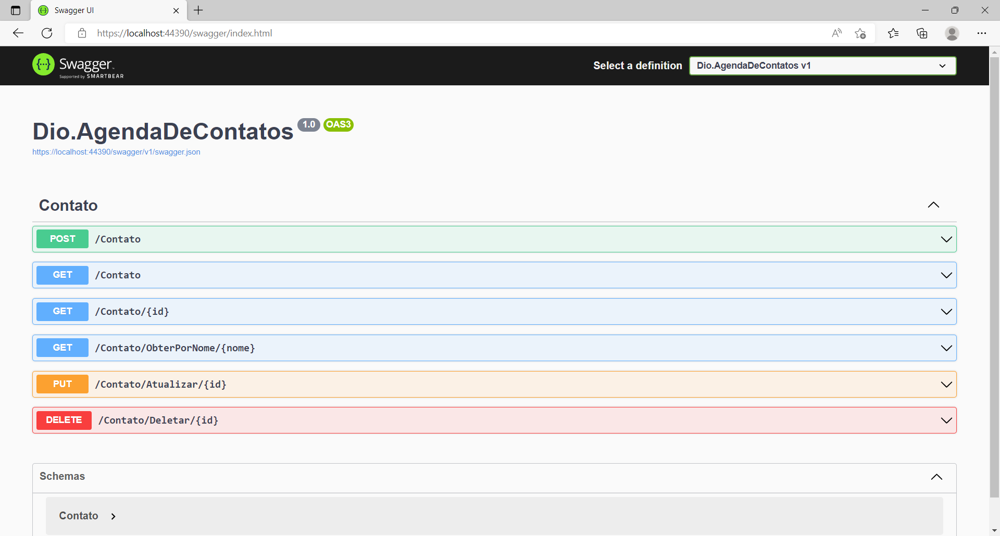
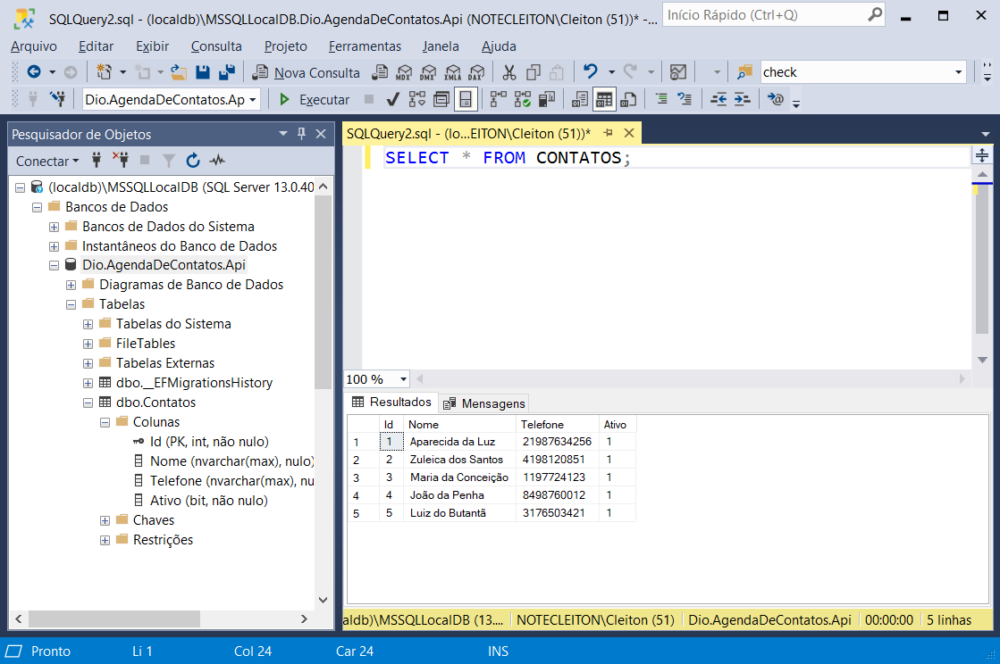

# DIO.BootcampPottencial.AgendaDeContatos.API 📞

Desenvolvida uma WebAPI utilizando o .NET 6, EntityFramework e SqlServer, onde é possível realizar as operações básicas do CRUD em registros de contatos telefônicos.

## Swagger-OpenAPI: ##

## Banco De Dados (SqlServer): ##

